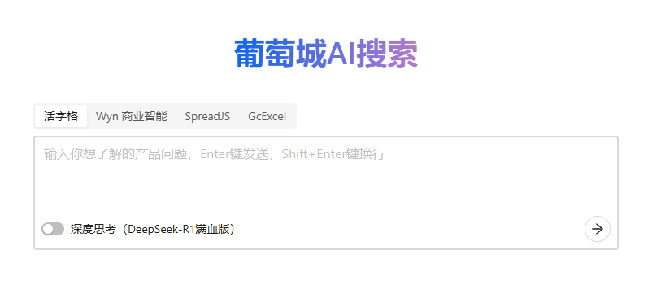
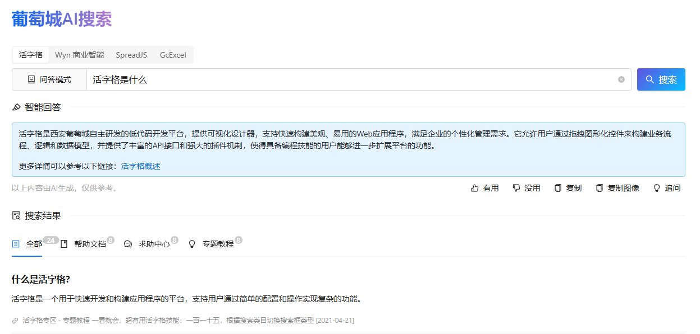

# GC-QA-RAG

[English Version](./README_ENGLISH.md) | 中文版

🌟 **核心价值**

-   **QA 预生成技术**  
    采用创新的问答对生成方法，相比传统文本切片技术，能够更精准的构建知识库，显著提升检索与问答效果。
-   **企业级场景验证**  
    已在真实业务场景中落地应用，实现从传统搜索到智能搜索的无缝升级，用户接受度与满意度明显提升。
-   **开源实践支持**  
    提供完整技术教程，并开放源代码，助力开发者快速搭建易于落地的高质量企业级 AI 知识库系统。

## 概述

GC-QA-RAG 是一款面向葡萄城产品生态（包括 活字格、WYN、SpreadJS 和 GCExcel 等）的检索增强生成（RAG）系统。该系统通过智能文档处理、高效知识检索、精准问答等功能，有效提升了知识管理效率和用户支持体验。

本系统创新性地采用了 QA 预生成技术，克服了传统文本切片方法在知识库构建中的若干局限性。经过实践验证，该技术方案能够显著提升检索效果，可为 RAG 领域的技术实践提供新的思路。

葡萄城秉持“赋能开发者”的理念，现将 GC-QA-RAG 项目完整开源：

-   对于初学者，我们提供了详细的入门指南，帮助您快速掌握 QA-RAG 系统的构建方法
-   对于面临传统架构挑战的开发者，我们的架构设计文档可为您提供参考，助力现有知识库的优化升级

本项目也分享了葡萄城在 RAG 知识库产品设计方面的实践经验，希望能为相关领域的产品和技术探索提供有益参考。

## 项目背景

作为企业级解决方案提供商，葡萄城积累了大量的产品用户。在日常使用中，用户需要快速获取准确的产品信息，但现有帮助文档和技术社区存在以下挑战：

-   内容分散在多个平台（约 4000 篇文档、2000 个教程帖和 50000 个主题帖）
-   传统关键词搜索效果有限，难以满足精准查询需求

基于 AI 大模型技术，我们开发了 GC-QA-RAG 系统，旨在：

-   提供更智能、高效的产品问题解答服务
-   优化技术支持流程，提升服务效率

> 查看[项目背景](./docs/0-项目概述/1_项目背景.md)了解更多。

## 产品设计

GC-QA-RAG 采用"传统搜索界面+智能问答"的混合设计模式，旨在结合搜索引擎的高效性与 AI 的智能化能力。经过对对话式 AI 助手的深入评估，我们发现传统搜索界面更符合用户对信息获取效率的核心需求，同时通过智能回答区域提供 AI 增强的交互体验。

> 查看[产品设计](./docs/0-项目概述/2_产品设计.md)了解更多。

### 核心功能

-   **双页面结构**：简洁的 Home 页聚焦搜索入口，Search 页呈现智能回答与分类搜索结果
-   **智能问答系统**：支持打字机效果的逐字输出，提供追问功能实现有限的多轮对话
-   **优化搜索结果**：
    -   四类选项卡分类展示（全部/帮助文档/求助中心/专题教程）
    -   预生成详细答案支持"展开更多"查看
    -   无分页设计提升浏览效率
-   **交互增强**：
    -   回答质量反馈（有用/没用）
    -   一键复制文本/图像
    -   实时显示各类结果数量

### 用户体验

产品通过清晰的界面层级和智能化的交互设计，在保持搜索效率的同时提供 AI 增强功能。默认的单次搜索模式确保响应速度，追问功能满足深度探索需求，而可视化的上下文管理帮助用户保持操作认知。这种平衡设计使用户既能快速获取核心信息，又可按需展开更深入的智能交互。

## 技术架构

GC-QA-RAG 采用三层架构设计，确保系统清晰高效且可扩展：

### 构建层 - ETL

-   文档解析：支持多种类型文档（产品说明文档，论坛帖子等）
-   QA 生成：基于文档内容自动生成问答对
-   向量化：将文本转换为高维向量，支持语义检索
-   索引构建：建立高效的检索索引与有效负载

### 检索层 - Retrieval

-   问题改写：优化用户查询，提高检索准确率
-   混合检索：结合关键词和语义检索
-   RRF 排序：基于相关性排序算法优化结果
-   结果融合：整合多源检索结果

### 生成层 - Generation

-   问答模式：对接文本大模型，直接回答用户问题
-   思考模式：对接推理大模型，先思考再回答
-   多轮对话：支持上下文相关的连续对话
-   答案优化：确保回答的准确性和可读性

> 查看[技术架构](./docs/0-项目概述/3_技术架构.md)了解更多。

## 技术挑战

在构建企业级 RAG 知识库系统的实践中，我们面临着知识表征方面的基础性挑战。这些挑战主要源于知识本身固有的时空特性，这在当前 AI 技术发展阶段呈现出显著的解决难度。

### 空间语义歧义问题

**问题描述**：  
产品不同模块中存在功能命名冲突现象。以活字格低代码平台为例，其文档中会出现以下情况：

-   页面模块的"数据透视表"功能
-   报表模块的"数据透视表"功能
-   表格报表模块的"数据透视表"功能
-   Excel 的"数据透视表"功能（大模型内部知识）

**影响**：  
这种命名冲突不仅给技术支持人员带来困扰，对 AI 系统的语义理解也构成了显著挑战。

### 时序版本管理问题

**问题描述**：  
同一功能在不同版本中存在特性差异，典型表现为：

-   知识库中收录了某个功能的多个版本文档
-   用户可能仍在使用旧版本，仅需了解特定版本的功能特性

**影响**：  
这种版本差异使得准确匹配用户实际环境中的功能特性变得复杂，增加了知识检索的难度。

## 落地效果

GC-QA-RAG 系统在实际业务场景中取得了令人鼓舞的应用成效，主要体现在以下几个方面：

-   **用户接受度与粘性**  
    系统上线后，用户访问量呈现稳步增长并逐渐趋于稳定，表明产品已经形成了稳定的用户群体和使用习惯。用户留存数据反映出较高的使用粘性，许多用户已将系统作为日常求疑解答的工具。

-   **持续的产品优化**  
    我们建立了完善的用户反馈机制，定期收集来自终端用户和技术支持团队的使用体验和改进建议。这些宝贵的实践反馈为系统迭代提供了明确方向，推动产品功能持续完善。

-   **用户群体认可度**  
    系统获得了用户群体的高度评价，其背后的技术创新思路也引起了专业开发者用户的广泛关注。技术原理和实现方案成为客户咨询探讨的热点，多个客户与团队表示希望借鉴相关经验。

-   **业务价值体现**  
    从实际使用效果来看，系统显著提升了技术支持效率和用户自助服务能力。知识获取革新带来可感知的流程优化，用户正向评价充分印证其成效。

这些成果不仅验证了产品和技术路线的可行性，也为后续发展奠定了坚实的基础。同时，我们相信 QA 预生成方案对文档型知识库具有普遍的参考价值。我们将继续秉持开放的态度，与用户社区和专业开发者携手合作，共同推动技术的不断进步。

> 查看[落地效果](./docs/0-项目概述/5_落地效果.md)了解更多。

## License

MIT
