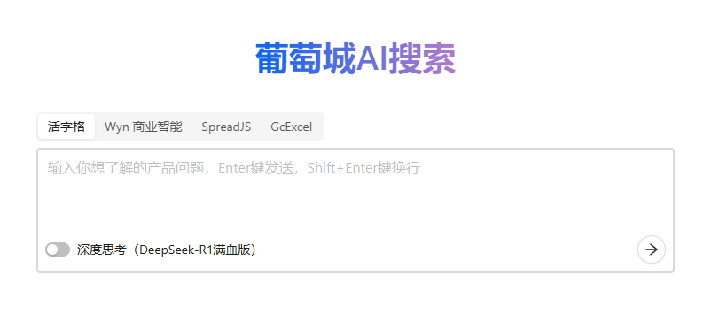

# GC-QA-RAG

[English Version](./README_ENGLISH.md) | **中文版**


GC-QA-RAG is an **enterprise-grade Retrieval-Augmented Generation (RAG) system**. Through our innovative **Advanced QA Pre-generation Technology**, we intelligently transform unstructured product documentation, community posts, and other content into high-quality Q&A knowledge bases, significantly improving retrieval accuracy and user experience.

**This project has completed comprehensive open-source adaptation**. Thanks to its advanced QA pre-generation technology, it can adapt to documents in almost any domain, building precise and efficient intelligent Q&A systems. We welcome you to deploy it immediately and quickly validate its effectiveness on your data. See also: [English README.md](./README_ENGLISH.md)

GC-QA-RAG 是一个**企业级的检索增强生成（RAG）系统**。我们通过创新的 **高级 QA 预生成技术**，将非结构化的产品文档、社区帖子等内容，智能地转化为高质量的问答知识库，显著提升了检索的精准度和用户体验。

**本项目已完成全面的开源适配改造**。得益于其高级 QA 预生成技术的特性，它几乎可以适配任何领域的文档，构建精准、高效的智能问答系统。欢迎你立即部署，快速验证其在你的数据上的效果。

**在线体验 Demo:** [**https://ai-assist.grapecity.com.cn/**](https://ai-assist.grapecity.com.cn/)



## ✨ 核心特性

-   🎯 **精准的检索效果**：独创 **高级 QA 预生成技术**，相比传统文本切片，能更深刻地理解文档语义，使召回内容与用户问题的匹配度更高。
-   🏢 **企业级场景验证**：已在葡萄城多个产品线的真实业务中落地，无缝升级了传统搜索，每日服务大量用户，获得了积极反馈。
-   🚀 **开箱即用的解决方案**：提供从知识库构建（ETL）、后端服务到前端界面的完整代码，并支持 Docker 一键部署，助力开发者快速搭建自己的高质量 RAG 系统。
-   📚 **详尽的文档教程**：提供从产品设计、技术架构到落地经验的全方位文档，不仅是开源代码，更是一套可复用的实践方法论。

## 🧪 AI 测评验证

为验证系统的实际效果，我们让多个主流大语言模型参与了"活字格"低代码平台的认证考试。测评采用三种模式：直接生成答案、结合知识库检索（GC-QA-RAG）、Agent 自动规划检索（基于 GC-QA-RAG）。

**测评结果汇总**：

| 考试科目                         | 模型                | 直接生成答案 | 结合知识库检索 (RAG) | Agent 自动规划检索 | **最大提升** |
| :------------------------------- | :------------------ | :----------- | :------------------- | :----------------- | :----------- |
| **认证工程师-科目一 (基础)**     | **Claude-4-sonnet** | 65.80%       | 81.03%               | **88.51%**         | +22.71%      |
|                                  | **GLM-4.5**         | 61.21%       | 84.20%               | 87.07%             | **+25.86%**  |
|                                  | **Qwen3**           | 67.82%       | 83.05%               | 85.92%             | +18.10%      |
| **认证工程师-科目二 (实践)**     | **Claude-4-sonnet** | 57.41%       | 69.44%               | **70.37%**         | +12.96%      |
|                                  | **GLM-4.5**         | 47.22%       | 64.81%               | 65.74%             | +18.52%      |
|                                  | **Qwen3**           | 51.85%       | 65.74%               | 68.52%             | +16.67%      |
| **高级认证工程师-科目一 (高级)** | **Claude-4-sonnet** | 52.94%       | 65.88%               | **74.12%**         | +21.18%      |
|                                  | **GLM-4.5**         | 57.65%       | 67.06%               | 68.24%             | +10.59%      |
|                                  | **Qwen3**           | 54.12%       | 61.18%               | 68.24%             | +14.12%      |

**核心发现**：

-   **Agent 模式效果最显著**：在所有测试中，Agent 自动规划检索模式的得分都是最高的，最高提升达 25.86%
-   **RAG 技术显著提升准确率**：所有模型在获得外部知识库支持后，成绩都有大幅提高
-   **Claude-4-sonnet 综合表现最佳**：在三个科目的 Agent 模式下均取得了最高分

📖 **查看完整测评报告**：[《让 LLM 做低代码考试，谁会胜出？》](./tools/gc-qa-rag-eval/让LLM做低代码考试谁会胜出.md)

## 📖 目录

-   [快速开始](#-快速开始)
    -   [Docker 一键部署 (推荐)](#-docker-一键部署-推荐)
    -   [手动部署](#-手动部署)
-   [核心理念：为何选择 QA 预生成？](#-核心理念为何选择高级-qa-预生成)
-   [技术架构](#%EF%B8%8F-技术架构)
-   [详细文档](#-详细文档)
-   [参与贡献](#-参与贡献)
-   [License](#License)

## 🚀 快速开始

我们强烈推荐使用 Docker 进行一键部署，这是体验本项目的最快方式。

**⚠️ 重要提醒**：在部署之前，您必须先配置 API 密钥，否则系统无法正常工作！密钥若有变更，需重启服务。

### 🐳 Docker 一键部署 (推荐)

确保你的机器已经安装了 `Docker` 和 `Docker Compose`。

**第一步：获取 API 密钥**

您需要准备以下 API 密钥：

-   **大语言模型 API**：推荐使用[阿里云百炼](https://bailian.console.aliyun.com/)或[OpenAI API](https://platform.openai.com/)
-   **嵌入模型 API**：推荐使用阿里云的文本嵌入模型（目前仅支持 text-embedding-v4）

**第二步：配置和部署**

#### 方法一：使用 Docker Hub 镜像（推荐）

```bash
# 1. 克隆项目
git clone https://github.com/GrapeCity-AI/gc-qa-rag.git
cd gc-qa-rag

# 2. 编辑 ETL 配置（也可在部署后的Web端界面修改配置）
cd sources/gc-qa-rag-etl/deploy
# 编辑 docker-compose.dockerhub.yml，取消注释并填入你的API密钥：
# GC_QA_RAG_LLM_API_KEY: "your_llm_api_key_here"
# GC_QA_RAG_EMBEDDING_API_KEY: "your_embedding_api_key_here"

# 3. 启动 ETL 服务
docker compose -f docker-compose.dockerhub.yml up -d

# 4. 编辑 RAG 配置
cd sources/gc-qa-rag-server/deploy
# 编辑 docker-compose.dockerhub.yml，取消注释并填入你的API密钥：
# GC_QA_RAG_LLM_DEFAULT_API_KEY: "your_llm_api_key_here"
# GC_QA_RAG_EMBEDDING_API_KEY: "your_embedding_api_key_here"

# 5. 启动 RAG 服务
docker compose -f docker-compose.dockerhub.yml up -d
```

#### 方法二：本地手动构建镜像

```bash
# 1. 克隆项目
git clone https://github.com/GrapeCity-AI/gc-qa-rag.git
cd gc-qa-rag

# 2. 配置API密钥 (必须！)
# 编辑 sources/gc-qa-rag-etl/.config.production.json 或 .env 文件
# 编辑 sources/gc-qa-rag-server/.config.production.json 或 .env 文件
# 填入您的API密钥

# 3. 进入 ETL 目录
cd sources/gc-qa-rag-etl/deploy

# 4. 构建 ETL 镜像，并启动服务
docker compose up -d --build

# 5. 进入 RAG 目录
cd sources/gc-qa-rag-server/deploy

# 6. 构建 RAG 镜像，并启动服务
docker compose up -d --build
```

**第三步：上传数据并开始使用**

1. **访问 ETL 管理后台**: `http://localhost:8001`

    - 上传您的 PDF、Word、Markdown 等文档
    - 等待系统处理并生成问答对
    - 发布数据到知识库

2. **访问 RAG 问答主页**: `http://localhost:80`
    - 基于您上传的文档内容开始提问
    - 享受智能问答体验！

**完整操作流程**：

```
准备API密钥 → 配置系统 → Docker部署 → 上传文档 → ETL处理 → 发布数据 → 前端测试 → 开始使用
```

更加详细的部署指南，请参考[《Docker 部署教程》](https://grapecity-ai.github.io/gc-qa-rag/zh/2-%E5%BC%80%E5%8F%91%E6%95%99%E7%A8%8B/1-Docker%E9%83%A8%E7%BD%B2/)

### 🔧 手动部署

如果你希望深入了解每个模块的细节，或者进行二次开发，可以选择手动部署。

**环境依赖:**

-   Python 3.13+ (及 PDM)
-   Node.js 16+ (及 pnpm)
-   MySQL
-   Qdrant

### 📋 配置说明

使用官方 Docker 镜像时，需要在 docker-compose.dockerhub.yml 文件中配置环境变量传递给容器。系统支持灵活的配置优先级：

**配置优先级**：`.saved.json 文件` > `Docker 环境变量` > `.env 文件` > `JSON 配置文件` > `默认值`

-   **`.saved.json 文件`**：通过前端界面修改配置时动态生成，优先级最高，确保用户修改的配置能够生效
-   **Docker 环境变量**：适合生产环境部署，通过 docker-compose 文件设置
-   **`.env 文件`**：适合开发环境，存储敏感信息如 API 密钥
-   **JSON 配置文件\*\***：基础配置模板，支持复杂的嵌套配置结构

**完整的环境变量列表请查看：**

-   RAG 服务：[`sources/gc-qa-rag-server/env.example`](./sources/gc-qa-rag-server/env.example)
-   ETL 服务：[`sources/gc-qa-rag-etl/env.example`](./sources/gc-qa-rag-etl/env.example)

**重要**：无论选择哪种部署方式，都需要先配置 API 密钥！

详细步骤请参考我们的[《快速开始指南》](./quickstart.md)。

## 💡 核心理念：为何选择高级 QA 预生成？

传统的 RAG 系统严重依赖于文档的“切片”（Chunking）质量。然而，简单的文本分割方法在处理复杂的企业级文档时，往往会遭遇**上下文失真**、**语义歧义**和**版本冲突**等问题，导致检索效果不佳。

我们最初也尝试了“全文投喂”的直观方案——将整篇文档交给大模型直接生成 QA 对。但实践证明，这条路充满陷阱：

-   **对于短文档**：模型缺乏足够上下文，极易“过度联想”，编造出原文不存在的信息。
-   **对于长文档**：模型存在“注意力天花板”，往往只能生成 10-15 个 QA 对，导致大量关键知识点被遗漏，或生成重复、泛化的内容。

为了从根本上解决这些问题，我们摒弃了粗糙的文本切片，设计了一套**自适应、多阶段的高级 QA 预生成系统**。其核心思想是：**从“切割文本”转向“精准提炼知识点”**。

这套系统主要通过以下创新机制实现：

#### 1. 动态自适应处理策略

我们不采用一刀切的方式，而是根据文档长短动态调整策略：

-   **短文档 - 句子级精准控制**：我们假设“一个句子对应一个知识点”，通过计算句子数量来动态指示模型生成等量的 QA 对，杜绝信息编造，确保内容忠于原文。
-   **长文档 - 两阶段记忆-聚焦机制**：我们独创了这种对话式生成方法。
    -   **第一阶段（记忆）**：让大模型“记住”全文，构建完整的上下文背景（长期记忆）。
    -   **第二阶段（聚焦）**：逐个片段提问，引导模型“聚焦”于局部细节进行精准的 QA 提取（短期专注）。
        这种机制完美解决了长文档的信息覆盖度和生成质量问题。

#### 2. 超越 QA：生成高价值衍生数据

所谓的“高级”之处不止于此。在生成核心 QA 的同时，系统还智能地派生出三种高价值数据，并一同存入向量数据库，极大增强了 RAG 系统的综合能力：

-   **① 摘要 (Summary)**：为每个知识点生成总结，提升生成时的上下文理解能力，利于大模型向用户推荐适合的关联文档。
-   **② 扩充答案 (Full Answer)**：为关键问题生成更详尽的解答，用于前端“展开更多”或作为生成答案时的丰富素材。
-   **③ 同义问法 (Question Variants)**：为每个问题生成多种相似问法，大幅提升对用户多样化提问的召回率。

#### 3. 工程化鲁棒性设计

我们为这套系统构建了完整的工程化保障，包括：自动化的文档解析、针对中文的自动分句、灵活的文本分组，以及最关键的**多重容错 JSON 解析机制**（从标准提取到强制转换，再到正则匹配），确保了在生产环境中几乎 100% 的生成成功率（失败时多为触发了内容合规机制）。

**综上所述，GC-QA-RAG 的核心理念是：通过模拟人类“记忆-聚焦”的学习方式和精密的工程化设计，将非结构化文档智能地转化为结构化的、多维度的高质量知识库，为下游的精准检索和高质量回答奠定坚实基础。**

## 🏗️ 技术架构

本系统采用模块化设计，分为三大核心层：

1.  **构建层 (ETL)**: 负责从各种数据源（文档、网页、论坛）提取信息，通过 **QA 生成** 和 **向量化**，构建高质量的知识库。
2.  **检索层 (Retrieval)**: 接收用户查询，通过 **问题改写**、**混合检索** 和 **RRF 排序**，高效、精准地从知识库中召回最相关的信息。
3.  **生成层 (Generation)**: 将检索到的信息整合，交由大语言模型（LLM）生成最终流畅、准确的答案，并支持多轮对话。

更多细节请查阅[《技术架构详解》](https://grapecity-ai.github.io/gc-qa-rag/zh/0-%E9%A1%B9%E7%9B%AE%E6%A6%82%E8%BF%B0/3_%E6%8A%80%E6%9C%AF%E6%9E%B6%E6%9E%84/)。

## 📚 详细文档

我们为你准备了完整的项目文档，帮助你深入了解从背景、设计到实践的每一个环节。

**访问我们的文档站：[https://grapecity-ai.github.io/gc-qa-rag/](https://grapecity-ai.github.io/gc-qa-rag/)**

主要内容包括：

-   [项目背景](https://grapecity-ai.github.io/gc-qa-rag/zh/0-%E9%A1%B9%E7%9B%AE%E6%A6%82%E8%BF%B0/1_%E9%A1%B9%E7%9B%AE%E8%83%8C%E6%99%AF/)
-   [产品设计](https://grapecity-ai.github.io/gc-qa-rag/zh/0-%E9%A1%B9%E7%9B%AE%E6%A6%82%E8%BF%B0/2_%E4%BA%A7%E5%93%81%E8%AE%BE%E8%AE%A1/)
-   [技术原理](https://grapecity-ai.github.io/gc-qa-rag/zh/1-%E6%8A%80%E6%9C%AF%E5%8E%9F%E7%90%86/1-%E5%88%87%E7%89%87%E6%96%B9%E6%A1%88/)
-   [落地效果](https://grapecity-ai.github.io/gc-qa-rag/zh/0-%E9%A1%B9%E7%9B%AE%E6%A6%82%E8%BF%B0/5_%E8%90%BD%E5%9C%B0%E6%95%88%E6%9E%9C/)

## 🤝 参与贡献

我们欢迎并鼓励社区参与贡献！无论是提交 Bug、提出功能建议，还是贡献代码，都对我们非常有价值。

## License

[MIT](./LICENSE)
