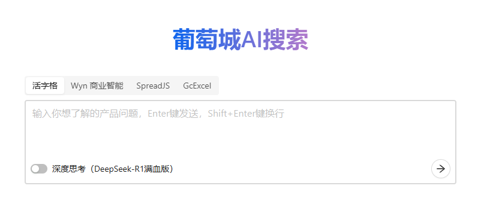

# GC-QA-RAG

[中文版](./README.md) | **English Version**


GC-QA-RAG is an **enterprise-grade Retrieval-Augmented Generation (RAG) system**. Through our innovative **Advanced QA Pre-generation Technology**, we intelligently transform unstructured product documentation, community posts, and other content into high-quality Q&A knowledge bases, significantly improving retrieval accuracy and user experience.

**This project has completed comprehensive open-source adaptation**. Thanks to its advanced QA pre-generation technology, it can adapt to documents in almost any domain, building precise and efficient intelligent Q&A systems. We welcome you to deploy it immediately and quickly validate its effectiveness on your data.

**Online Demo:** [**https://ai-assist.grapecity.com.cn/**](https://ai-assist.grapecity.com.cn/)



## ✨ Core Features

-   🎯 **Precise Retrieval Results**: Our original **Advanced QA Pre-generation Technology** provides deeper understanding of document semantics compared to traditional text chunking, achieving higher matching between recalled content and user questions.
-   🏢 **Enterprise-validated Scenarios**: Successfully deployed in real business scenarios across multiple GrapeCity product lines, seamlessly upgrading traditional search and serving thousands of users daily with positive feedback.
-   🚀 **Ready-to-use Solution**: Provides complete code from knowledge base construction (ETL), backend services to frontend interfaces, with Docker one-click deployment support, helping developers quickly build high-quality RAG systems.
-   📚 **Comprehensive Documentation**: Offers complete documentation covering product design, technical architecture, and implementation experience - not just open-source code, but a reusable methodology.

## 📖 Table of Contents

-   [Quick Start](#-quick-start)
    -   [Docker One-click Deployment (Recommended)](#-docker-one-click-deployment-recommended)
    -   [Manual Deployment](#-manual-deployment)
-   [Core Philosophy: Why Choose Advanced QA Pre-generation?](#-core-philosophy-why-choose-advanced-qa-pre-generation)
-   [Technical Architecture](#%EF%B8%8F-technical-architecture)
-   [Detailed Documentation](#-detailed-documentation)
-   [Contributing](#-contributing)
-   [License](#license)

## 🚀 Quick Start

We strongly recommend using Docker for one-click deployment - this is the fastest way to experience this project.

**⚠️ Important Note**: You must configure API keys before deployment, otherwise the system won't work properly! If keys change, restart the service.

### 🐳 Docker One-click Deployment (Recommended)

Ensure your machine has `Docker` and `Docker Compose` installed.

**Step 1: Get API Keys**

You need to prepare the following API keys:

-   **Large Language Model API**: We recommend [Alibaba Cloud Qwen](https://dashscope.console.aliyun.com/) or [OpenAI API](https://platform.openai.com/)
-   **Embedding Model API**: We recommend using Alibaba Cloud Qwen's embedding model

**Step 2: Configuration and Deployment**

Knowledge base deployment:

```bash
# 1. Clone the project
git clone https://github.com/GrapeCity-AI/gc-qa-rag.git
cd gc-qa-rag

# 2. Configure API keys (Required!)
# Edit sources/gc-qa-rag-etl/.config.production.json
# Edit sources/gc-qa-rag-server/.config.production.json
# Fill in your API keys

# 3. Enter deployment directory
cd sources/gc-qa-rag-server/deploy

# 4. Start all services
docker compose up -d --build
```

ETL management backend deployment:

```bash
# Enter ETL directory
cd sources/gc-qa-rag-etl

# Build Docker image
docker build -t rag-etl:latest .

# Run container
docker run -d \
  --name rag-etl \
  -p 8001:8001 \
  -e GC_QA_RAG_ENV=production \
  rag-etl:latest
```

**Step 3: Upload Data and Start Using**

1. **Access ETL Management Backend**: `http://localhost:8001`

    - Upload your PDF, Word, Markdown and other documents
    - Wait for system processing and Q&A pair generation
    - Publish data to knowledge base

2. **Access RAG Q&A Homepage**: `http://localhost:80`
    - Start asking questions based on your uploaded document content
    - Enjoy the intelligent Q&A experience!

**Complete Operation Flow**:

```
Prepare API Keys → Configure System → Docker Deploy → Upload Documents → ETL Process → Publish Data → Frontend Test → Start Using
```

For more detailed deployment guide, please refer to [Docker Deployment Tutorial](https://grapecity-ai.github.io/gc-qa-rag/en/2-development-tutorial/1-docker-deployment/)

### 🔧 Manual Deployment

If you want to understand the details of each module or perform secondary development, you can choose manual deployment.

**Environment Dependencies:**

-   Python 3.13+ (with PDM)
-   Node.js 16+ (with pnpm)
-   MySQL
-   Qdrant

**Important**: Regardless of which deployment method you choose, you need to configure API keys first!

For detailed steps, please refer to our [Quick Start Guide](./quickstart_ENGLISH.md).

## 💡 Core Philosophy: Why Choose Advanced QA Pre-generation?

Traditional RAG systems heavily rely on the quality of document "chunking". However, simple text segmentation methods often encounter **context distortion**, **semantic ambiguity**, and **version conflicts** when processing complex enterprise documents, leading to poor retrieval performance.

We initially tried the intuitive "full-text feeding" approach - feeding entire documents directly to large models to generate Q&A pairs. But practice proved this path is full of pitfalls:

-   **For short documents**: Models lack sufficient context and tend to "over-associate," fabricating information that doesn't exist in the original text.
-   **For long documents**: Models have an "attention ceiling" and often can only generate 10-15 Q&A pairs, causing massive knowledge point omissions or generating repetitive, generalized content.

To fundamentally solve these problems, we abandoned crude text chunking and designed an **adaptive, multi-stage advanced QA pre-generation system**. The core idea is: **shifting from "cutting text" to "precisely extracting knowledge points"**.

This system achieves this mainly through the following innovative mechanisms:

#### 1. Dynamic Adaptive Processing Strategy

Instead of a one-size-fits-all approach, we dynamically adjust strategies based on document length:

-   **Short Documents - Sentence-level Precise Control**: We assume "one sentence corresponds to one knowledge point" and dynamically instruct the model to generate equivalent Q&A pairs by calculating sentence count, eliminating information fabrication and ensuring content fidelity to the original text.
-   **Long Documents - Two-stage Memory-Focus Mechanism**: We created this conversational generation method.
    -   **Stage 1 (Memory)**: Let the large model "remember" the full text, building complete contextual background (long-term memory).
    -   **Stage 2 (Focus)**: Question each segment individually, guiding the model to "focus" on local details for precise Q&A extraction (short-term attention).
        This mechanism perfectly solves information coverage and generation quality issues for long documents.

#### 2. Beyond Q&A: Generating High-value Derivative Data

The "advanced" aspect goes beyond this. While generating core Q&A pairs, the system also intelligently derives three types of high-value data, storing them all in the vector database to greatly enhance the RAG system's comprehensive capabilities:

-   **① Summary**: Generates summaries for each knowledge point, improving contextual understanding during generation and helping large models recommend relevant documents to users.
-   **② Full Answer**: Generates more detailed answers for key questions, used for frontend "expand more" features or as rich materials for answer generation.
-   **③ Question Variants**: Generates multiple similar phrasings for each question, significantly improving recall rates for diverse user questions.

#### 3. Engineering Robustness Design

We built complete engineering safeguards for this system, including: automated document parsing, automatic sentence segmentation for Chinese, flexible text grouping, and most critically, **multiple fault-tolerant JSON parsing mechanisms** (from standard extraction to forced conversion to regex matching), ensuring nearly 100% generation success rate in production environments (failures are usually due to content compliance mechanisms).

**In summary, GC-QA-RAG's core philosophy is: by simulating human "memory-focus" learning patterns and precise engineering design, intelligently transforming unstructured documents into structured, multi-dimensional high-quality knowledge bases, laying a solid foundation for downstream precise retrieval and high-quality answers.**

## 🏗️ Technical Architecture

This system adopts a modular design with three core layers:

1. **Construction Layer (ETL)**: Responsible for extracting information from various data sources (documents, web pages, forums), building high-quality knowledge bases through **QA generation** and **vectorization**.
2. **Retrieval Layer (Retrieval)**: Receives user queries and efficiently, precisely recalls the most relevant information from the knowledge base through **query rewriting**, **hybrid retrieval**, and **RRF ranking**.
3. **Generation Layer (Generation)**: Integrates retrieved information and uses Large Language Models (LLM) to generate final fluent, accurate answers, supporting multi-turn conversations.

For more details, please see [Technical Architecture Details](https://grapecity-ai.github.io/gc-qa-rag/en/0-project-overview/3_technical-architecture/).

## 📚 Detailed Documentation

We have prepared complete project documentation to help you deeply understand every aspect from background and design to implementation.

**Visit our documentation site: [https://grapecity-ai.github.io/gc-qa-rag/](https://grapecity-ai.github.io/gc-qa-rag/)**

Main content includes:

-   [Project Background](https://grapecity-ai.github.io/gc-qa-rag/en/0-project-overview/1_project-background/)
-   [Product Design](https://grapecity-ai.github.io/gc-qa-rag/en/0-project-overview/2_product-design/)
-   [Technical Principles](https://grapecity-ai.github.io/gc-qa-rag/en/1-technical-principles/1-chunking-solution/)
-   [Implementation Results](https://grapecity-ai.github.io/gc-qa-rag/en/0-project-overview/5_implementation-results/)

## 🤝 Contributing

We welcome and encourage community contributions! Whether submitting bugs, proposing features, or contributing code, all are valuable to us.

## License

[MIT](./LICENSE)
