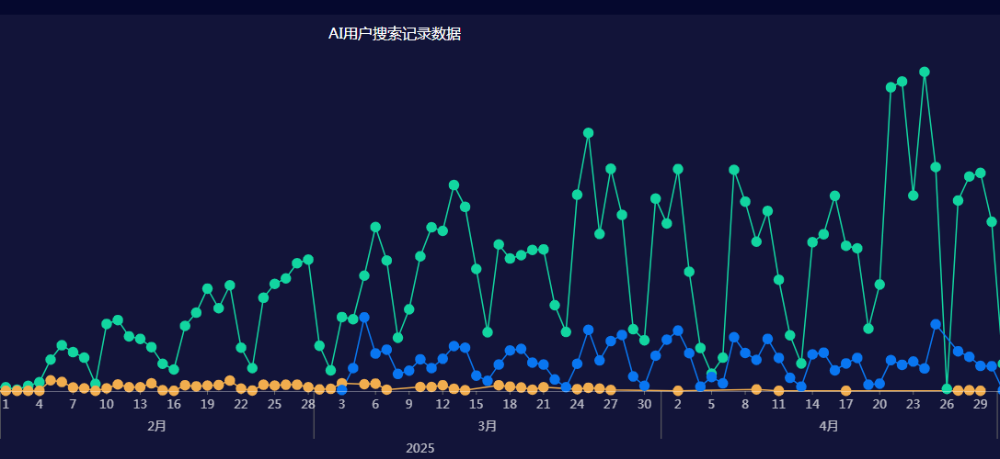

# Implementation Results

With the gradual implementation of the intelligent Q&A system across GrapeCity's multiple product lines, we have not only completed the entire technical lifecycle from knowledge construction to retrieval generation, but also achieved significant results in actual business scenarios.

## User Feedback

### Usage Statistics

Since the system launch, user traffic has shown a steady upward trend, forming a stable user base and achieving high penetration rates across multiple product portals.

#### 1. User Growth Performance

-   **Daily Active Users (DAU) remain stable** Daily independent visiting users have reached expected saturation levels
-   **Weekly Active Users continue to grow** From launch to present, weekly active users have multiplied several times
-   **User retention rate significantly improved** 30-day retention rate is high, indicating high user acceptance
-   **Question frequency increased** Average number of questions each user asks per week has risen

#### 2. Usage Habit Changes

-   Most users have made the system their daily work support tool for quickly finding function usage and solving problems;
-   Self-service capabilities significantly enhanced, users can obtain effective answers without waiting for human customer service;
-   Problem-solving efficiency greatly improved, with average response time controlled within 3 seconds;
-   User satisfaction survey results show predominantly positive overall evaluations.

### User Evaluations

We collected extensive user direct evaluations of system functionality and experience through questionnaire surveys, interface like/dislike mechanisms, and technical support feedback.

#### 1. Functionality Evaluations

-   **Retrieval effectiveness significantly improved**: Users believe search results are more precise;
-   **High Q&A accuracy**: Most question answers accurately match user intentions;
-   **Fast response speed**: Most interface response times within 2 seconds, meeting expectations;
-   **User-friendly interface**: Simple interaction design lowers usage barriers, new users get started quickly.

#### 2. Experience Evaluations

-   Simple and intuitive operation process, no complex training required;
-   Low learning cost, suitable for user groups at different levels;
-   Smooth system operation, no frequent lag or request failures;
-   Strong practical functionality, especially well-received in document queries and problem location.

## Business Value

### Efficiency Improvement

#### 1. Technical Support Efficiency

-   **Problem resolution time shortened**: Through self-service Q&A, average problem processing time reduced from hours to instant response;
-   **Reduced human intervention**: Common question inquiries decreased, freeing up substantial customer service resources;
-   **Improved service response speed**: Users can obtain answers anytime, no longer limited by customer service hours;
-   **Reduced support costs**: Saved human resources investment, improved overall service cost-effectiveness.

#### 2. User Self-service Capabilities

-   **Self-service ratio significantly improved**: Common problems automatically resolved through the system;
-   **Reduced user wait times**: Real-time answer acquisition, no need for long queue waits;
-   **Improved service satisfaction**: "Quick" and "useful" became high-frequency keywords in user feedback.

### Cost Optimization

#### 1. Operational Costs

-   **Reduced labor costs**: Decreased dependence on human customer service, reallocating related personnel to higher-value tasks;
-   **Reduced training costs**: Users can quickly find operation guidance through the system, reducing repetitive instruction needs;
-   **Optimized maintenance costs**: Unified knowledge base management mechanisms reduced operational burdens from content updates and version differences;
-   **Improved resource utilization**: Reasonable server and database load distribution, high overall resource usage efficiency.

#### 2. Management Costs

-   **Improved knowledge management efficiency**: Using structured QA pair format, convenient for classification, retrieval, and updates;
-   **Reduced content update costs**: High ETL process automation, documents can be synchronized online within 24-48 hours after updates;
-   **Optimized operation and maintenance costs**: System has comprehensive monitoring and alert mechanisms, rapid fault response;
-   **Improved management efficiency**: Data visualization platform supports multi-dimensional analysis, assisting decision optimization.

## Industry Impact

### Technical Impact

#### 1. Technical Innovation

-   Successfully validated the feasibility of QA-RAG technical approaches in enterprise-level knowledge services;
-   Provided a complete RAG practical solution covering the entire process from product design to engineering implementation;
-   Expected to further promote technological progress in semantic retrieval combined with large models in the future, gaining widespread recognition in the technical community;

#### 2. Practical Value

-   Output a reusable technical architecture and implementation solution to the industry;
-   Shared rich practical experience, including QA pair pre-generation, QA pair hybrid ranking methods, etc.;
-   Promoted deep integration of large models with enterprise internal and external knowledge services;
-   Provided reference for subsequent intelligent Q&A system construction in more industries.

## Continuous Optimization

Although the system has achieved good results, we always maintain the philosophy of "continuous improvement." We will continue to conduct multi-faceted optimization around product capabilities, content quality, and service experience.

### Product Optimization

#### 1. Functionality Optimization

-   Continuously optimize retrieval algorithms to improve recall rate and accuracy;
-   Enhance Q&A experience, support text-image mixing, sharing Q&A, etc.;
-   Improve system performance, optimize resource scheduling and interface response;
-   Enhance user experience, improve multi-turn conversation and context understanding.

#### 2. Content Optimization

-   Improve knowledge base coverage, expand content like API documentation, tutorial videos, etc.;
-   Optimize Q&A quality, continuously correct false detection issues through user feedback;
-   Regularly update technical documentation to ensure content consistency with latest product versions;
-   Improve content quality, strengthen detail supplementation and expression optimization for Full Answers.

Through continuous refinement and technological innovation, we expect our intelligent Q&A system to gradually become more useful and helpful in the future, providing solid support for enterprise knowledge service system construction.
