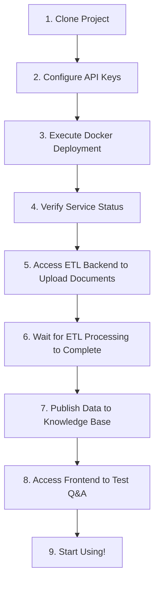

# Docker Deployment Tutorial

This tutorial will guide you through deploying the GC-QA-RAG system using Docker. Two deployment methods are provided: **One-click deployment** (recommended) and **Individual deployment**.

## 1. Environment Preparation

### Required Tools

-   Docker 20.0+
-   Docker Compose 2.0+

### System Requirements

-   Recommended Memory: 8GB+
-   Recommended Storage: 20GB+ available space

## 2. Essential Configuration Before Deployment ⚠️

**Important Notice**: Before executing one-click deployment, you must configure the following critical information, otherwise the services will not start properly. If API keys are changed, services need to be restarted.

### 2.1 Configure API Keys (Required)

The system requires API keys for large language models and embedding models to function properly.

#### ETL Module Configuration

Edit `sources/gc-qa-rag-etl/.config.production.json`:

```json
{
    "das": {
        "base_url_page": "",
        "base_url_thread": "",
        "token": ""
    },
    "llm": {
        "api_key": "your-dashscope-api-key",
        "api_base": "https://dashscope.aliyuncs.com/compatible-mode/v1",
        "model_name": "qwen-plus"
    },
    "embedding": {
        "api_key": "your-dashscope-api-key"
    },
    "vector_db": {
        "host": "http://localhost:6333"
    },
    "root_path": "./.rag-cache",
    "log_path": "./"
}
```

#### Server Configuration

Edit `sources/gc-qa-rag-server/.config.production.json`:

```json
{
    "database": {
        "host": "rag_mysql_container",
        "port": 3306,
        "username": "search_db_user",
        "password": "12345678",
        "database": "search_db"
    },
    "qdrant": {
        "url": "http://rag_qdrant_container:6333"
    },
    "llm": {
        "provider": "openai",
        "api_key": "your-api-key",
        "base_url": "https://api.openai.com/v1"
    },
    "embedding": {
        "api_key": "your-dashscope-api-key"
    }
}
```

**API Key Acquisition Guide**:

-   **Tongyi Qianwen API**: Visit [Alibaba Cloud Dashscope](https://dashscope.console.aliyun.com/) to get API keys
-   **OpenAI API**: Visit [OpenAI Platform](https://platform.openai.com/) to get API keys
-   **Other Models**: Obtain corresponding keys from your chosen LLM provider

### 2.2 About DAS Configuration

The `das` section in the configuration file is for the **Data Acquisition System**:

-   It's used to crawl web documents and forum posts
-   If you only want to test the system or upload local documents, you can **leave it empty**
-   The system provides an ETL frontend interface that supports direct document file uploads for processing

## 3. One-Click Deployment (Recommended)

### 3.1 Deployment Method Selection

The system provides three one-click deployment methods. You can choose based on your needs:

#### Method 1: Docker Hub Image Deployment (Recommended for Production)

Using `docker-compose.dockerhub.yml`, uses pre-published Docker Hub images:

```bash
# Navigate to deployment directory
cd sources/gc-qa-rag-server/deploy

# Start services using Docker Hub images
docker compose -f docker-compose.dockerhub.yml up -d
```

**Use Cases**:

-   ✅ Production environment deployment
-   ✅ Quick startup (no build time required)
-   ✅ Using stable versions
-   ✅ Good network environment

**Note**: Before using, you need to replace `your-dockerhub-username` in the configuration file with your actual Docker Hub username.

#### Method 2: Auto-Build Deployment (Recommended for Beginners)

Using `docker-compose.yml`, the system will automatically build the latest code:

```bash
# Navigate to deployment directory
cd sources/gc-qa-rag-server/deploy

# Build and start all services (first run will automatically build images)
docker compose up -d --build
```

**Use Cases**:

-   ✅ First-time deployment
-   ✅ Development and testing environment
-   ✅ Want to use latest code
-   ✅ Don't want to manually build images

#### Method 3: Pre-Built Image Deployment

Using `docker-compose.image.yml`, uses locally pre-built images:

```bash
# Navigate to deployment directory
cd sources/gc-qa-rag-server/deploy

# First build required images
cd ../
docker build -t rag-server:latest .
cd ../gc-qa-rag-frontend
docker build -t rag-frontend:latest .

# Return to deployment directory and start services
cd ../gc-qa-rag-server/deploy
docker compose -f docker-compose.image.yml up -d
```

**Use Cases**:

-   ✅ Strict version control environment
-   ✅ Existing local image registry
-   ✅ Limited network environment

### 3.2 Service Components

Both deployment methods include complete RAG system core services:

-   MySQL Database
-   Qdrant Vector Database
-   RAG Backend Service
-   RAG Frontend Interface

**Note**: The above only includes RAG system core services. The ETL data processing module needs to be deployed separately.

**Description**:

-   During first deployment, the system will automatically build `rag-server` and `rag-frontend` images, which may take several minutes
-   The `--build` parameter ensures images are built with the latest code

### 3.3 ETL Module Deployment

The ETL module is responsible for data collection, processing, and vectorization, and is an important component of the complete RAG system. It needs to be deployed separately after core services are started:

#### Method 1: Docker Hub Image Deployment (Recommended)

```bash
# Navigate to ETL directory
cd sources/gc-qa-rag-etl/deploy

# Start services using Docker Hub images
docker compose -f docker-compose.dockerhub.yml up -d
```

#### Method 2: Local Build Deployment

```bash
# Navigate to ETL directory
cd sources/gc-qa-rag-etl

# Build Docker image
docker build -t rag-etl:latest .

# Run container
docker run -d \
  --name rag-etl \
  -p 8001:8001 \
  -e GC_QA_RAG_ENV=production \
  rag-etl:latest
```

### 3.4 Service Access

After deployment is complete, you can access through the following addresses:

-   **Frontend Interface**: http://localhost
-   **Backend API**: http://localhost:8000
-   **MySQL**: localhost:3306
-   **Qdrant**: http://localhost:6333

ETL Application:

-   **ETL Management Interface**: http://localhost:8001

### 3.5 Default Configuration

| Service    | Port      | Username       | Password |
| ---------- | --------- | -------------- | -------- |
| MySQL      | 3306      | search_db_user | 12345678 |
| MySQL Root | 3306      | root           | 12345678 |
| Qdrant     | 6333/6334 | -              | -        |
| ETL        | 8001      | -              | -        |

### 3.6 Stop Services

Choose the corresponding stop command based on the deployment method you used:

#### Method 1: Docker Hub Image Deployment

```bash
# Stop all services
docker compose -f docker-compose.dockerhub.yml down

# Stop services and delete data volumes (use with caution)
docker compose -f docker-compose.dockerhub.yml down -v
```

#### Method 2: Auto-Build Deployment

```bash
# Stop all services
docker compose down

# Stop services and delete data volumes (use with caution)
docker compose down -v
```

#### Method 3: Pre-Built Image Deployment

```bash
# Stop all services
docker compose -f docker-compose.image.yml down

# Stop services and delete data volumes (use with caution)
docker compose -f docker-compose.image.yml down -v
```

#### Stop ETL Service

**Docker Hub Image Deployment:**

```bash
# Stop ETL service
docker compose -f docker-compose.dockerhub.yml down
```

**Local Build Deployment:**

```bash
# Stop ETL service
docker stop rag-etl
docker rm rag-etl
```

## 4. Post-Deployment Usage Flow 🚀

After successful deployment, please follow these steps to start using the system:

### 4.1 Verify Service Status

First confirm that all services have started normally:

```bash
# View all service status
docker compose ps

# All services should show "running" status
```

### 4.2 Step 1: Prepare Data (ETL Processing)

**⚠️ Important**: The newly deployed system has an empty Qdrant vector database. You need to upload and process document data first.

1. **Access ETL Management Backend**: http://localhost:8001

2. **Upload Documents**:

    - Upload your PDF, Word, Markdown, and other document files

3. **Process Data**:

    - The system will automatically convert documents into Q&A pairs
    - Generate vectors and store them in the Qdrant database
    - Processing may take several minutes depending on document size

4. **Publish to Knowledge Base**:
    - In the ETL interface, publish the processed data to the RAG system
    - Ensure data has been successfully synchronized to the vector database

### 4.3 Step 2: Test Q&A System

1. **Access Frontend Interface**: http://localhost:80

2. **Start Asking Questions**:
    - Ask questions based on the content of your uploaded documents
    - The system will retrieve relevant information from the vector database and generate answers

### 4.4 Troubleshooting

If you encounter problems, please check in the following order:

1. **API Key Configuration Error**:

    ```bash
    # View server logs
    docker compose logs server
    # View ETL logs
    docker logs rag-etl
    ```

2. **Empty Vector Database**:

    - Confirm ETL processing steps have been completed
    - Visit http://localhost:6333/dashboard to check Qdrant database status

3. **Document Upload Failed**:
    - Check if document format is supported (PDF, Word, Markdown, TXT, etc.)
    - Confirm ETL service is running normally

### 4.5 Complete Beginner Operation Flow

For completely unfamiliar users, it's recommended to follow this order:



**Detailed Steps**:

1. Clone project to local machine
2. Modify configuration files according to "2.1 Configure API Keys"
3. Run `docker compose up -d --build`
4. Wait for all containers to start completely
5. Visit http://localhost:8001 to upload your documents
6. Process documents in ETL interface (generate QA pairs and vectors)
7. Publish processed data to RAG system
8. Visit http://localhost:80 to start Q&A
9. Enjoy the intelligent Q&A experience!

## 5. Individual Deployment

If you need a more flexible deployment approach, you can build and deploy each module individually.

### 5.1 Backend Service Deployment

```bash
# Navigate to server directory
cd sources/gc-qa-rag-server

# Build Docker image
docker build -t rag-server:latest .

# Create configuration file mount point
mkdir -p config

# Run container
docker run -d \
  --name rag-server \
  -p 8000:8000 \
  -e GC_QA_RAG_ENV=production \
  rag-server:latest
```

### 5.2 Frontend Interface Deployment

```bash
# Navigate to frontend directory
cd sources/gc-qa-rag-frontend

# First build frontend resources
pnpm install
pnpm run build

# Build Docker image
docker build -t rag-frontend:latest .

# Run container
docker run -d \
  --name rag-frontend \
  -p 80:80 \
  rag-frontend:latest
```

### 5.3 Database Deployment

#### MySQL Deployment

```bash
docker run -d \
  --name rag-mysql \
  -p 3306:3306 \
  -e MYSQL_ROOT_PASSWORD=12345678 \
  -e MYSQL_DATABASE=search_db \
  -e MYSQL_USER=search_db_user \
  -e MYSQL_PASSWORD=12345678 \
  -v rag-mysql-data:/var/lib/mysql \
  mysql:latest
```

#### Qdrant Deployment

```bash
docker run -d \
  --name rag-qdrant \
  -p 6333:6333 \
  -p 6334:6334 \
  -e QDRANT__SERVICE__GRPC_PORT=6334 \
  -e QDRANT__SERVICE__HTTP_PORT=6333 \
  -v rag-qdrant-data:/qdrant/storage \
  --memory 8g \
  qdrant/qdrant:latest
```

## 6. Configuration File Description

### 6.1 ETL Configuration

Configure in `sources/gc-qa-rag-etl/.config.production.json`:

```json
{
    "das": {
        "base_url_page": "",
        "base_url_thread": "",
        "token": ""
    },
    "llm": {
        "api_key": "",
        "api_base": "https://dashscope.aliyuncs.com/compatible-mode/v1",
        "model_name": "qwen-plus"
    },
    "embedding": {
        "api_key": "your-dashscope-api-key"
    },
    "vector_db": {
        "host": "http://localhost:6333"
    },
    "root_path": "./.rag-cache",
    "log_path": "./"
}
```

### 6.2 Server Configuration

Configure in `sources/gc-qa-rag-server/.config.production.json`:

```json
{
    "database": {
        "host": "rag_mysql_container",
        "port": 3306,
        "username": "search_db_user",
        "password": "12345678",
        "database": "search_db"
    },
    "qdrant": {
        "url": "http://rag_qdrant_container:6333"
    },
    "llm": {
        "provider": "openai",
        "api_key": "your-api-key",
        "base_url": "https://api.openai.com/v1"
    }
}
```

## 7. Production Environment Optimization

### 7.1 Resource Limits

Add resource limits to `docker-compose.yml`:

```yaml
services:
    server:
        deploy:
            resources:
                limits:
                    memory: 2G
                    cpus: "1.0"
                reservations:
                    memory: 1G
```

## 8. Common Issues

### 8.1 Port Conflicts

If ports are occupied, you can modify port mapping in `docker-compose.yml`:

```yaml
ports:
    - "8080:8000" # Map backend service to port 8080
```

### 8.2 Insufficient Memory

If system memory is insufficient, you can adjust Qdrant's memory limit:

```yaml
deploy:
    resources:
        limits:
            memory: 4G # Lower memory limit
```

### 8.3 Data Persistence

Ensure data volumes are properly mounted to avoid data loss after container restart:

```bash
# View data volumes
docker volume ls

# Backup data volumes
docker run --rm -v rag-mysql-data:/data -v $(pwd):/backup alpine tar czf /backup/mysql-backup.tar.gz -C /data .
```

### 8.4 Network Connection Issues

If containers cannot communicate with each other, check network configuration:

```bash
# View networks
docker network ls

# Check container network
docker network inspect rag_network
```

### 8.5 Docker Hub Image Related Issues

#### Q: Failed to pull image, showing "manifest not found"

A: Check if the image name is correct and confirm the image has been published to Docker Hub

#### Q: Failed to start using Docker Hub images

A: Confirm that you have correctly modified the username in the configuration file and check network connectivity

#### Q: How to update to the latest version of images

A: Use the following commands to pull the latest images:

```bash
docker pull grapecitysoftware/gc-qa-rag-server:latest
docker pull grapecitysoftware/gc-qa-rag-frontend:latest
docker pull grapecitysoftware/gc-qa-rag-etl:latest
```

#### Q: How to view image version information

A: Use the following command to view image details:

```bash
docker inspect your-username/gc-qa-rag-server:latest
```

## 9. Monitoring and Maintenance

### 9.1 Container Status Monitoring

```bash
# View all service status
docker compose ps

# View service logs
docker compose logs -f server

# View resource usage
docker stats
```

Through the above steps, you can successfully deploy the GC-QA-RAG system. Docker Hub image deployment is recommended as it's simple, quick, and fully configured.
