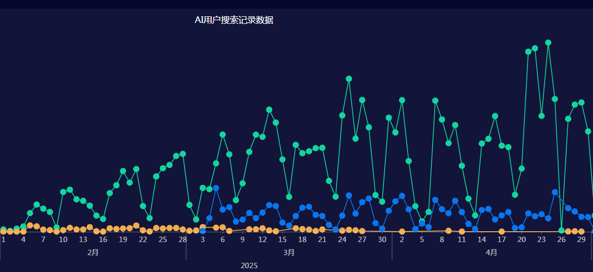

# 落地效果

随着智能问答系统在葡萄城多款产品线中的逐步落地，我们不仅完成了从知识构建到检索生成的完整技术生命周期，更在实际业务场景中取得了显著成效。

## 用户反馈

### 使用情况

自系统上线以来，用户访问量呈稳步上升趋势，已形成稳定的使用群体，并在多个产品端口实现了高渗透率。

#### 1. 用户增长表现

-   **日活跃用户数（DAU）保持稳定** 日均独立访问用户达到预期饱和程度
-   **周活跃用户持续增长** 从刚上线到目前周活跃用户已经翻了数倍
-   **用户留存率提升明显** 30 天留存率高，说明用户认可度高
-   **提问频率增加** 平均每位用户每周提出问题数量上升

#### 2. 使用习惯变化

-   多数用户已将系统作为日常工作支持工具，用于快速查找功能用法和解决问题；
-   自助服务能力显著增强，用户无需等待人工客服即可获取有效解答；
-   问题解决效率大幅提升，平均响应时间控制在 3 秒以内；
-   用户满意度调查结果显示，整体评价正向居多。

### 用户评价

我们通过问卷调查、界面点踩点赞机制以及技术支持反馈，收集了大量用户对系统功能与体验的直接评价。

#### 1. 功能评价

-   **检索效果显著提升**：用户认为搜索结果更加精准；
-   **问答准确性高**：多数问题回答能准确匹配用户意图；
-   **响应速度快**：多数接口响应时间在 2 秒以内，符合预期；
-   **界面友好易用**：简洁的交互设计降低了使用门槛，新用户上手快。

#### 2. 体验评价

-   操作流程简单直观，无需复杂培训即可使用；
-   学习成本低，适合不同层次的用户群体；
-   系统运行流畅，未出现频繁卡顿或请求失败现象；
-   功能实用性强，尤其在文档查询、问题定位方面广受好评。

## 业务价值

### 效率提升

#### 1. 技术支持效率

-   **问题解决时间缩短**：通过自助问答服务，平均问题处理时间由原来的小时级降低至即时响应；
-   **人工干预减少**：常见问题咨询量下降，释放了大量客服资源；
-   **服务响应速度提升**：用户可随时获取答案，不再受限于客服工作时间；
-   **支持成本降低**：节省人力投入，提升了整体服务性价比。

#### 2. 用户自助能力

-   **自助服务比例显著提升**：常见问题通过系统自动解决；
-   **用户等待时间减少**：实时获取答案，无需长时间排队等待；
-   **服务满意度提升**：用户反馈中“快捷”、“有用”成为高频关键词。

### 成本优化

#### 1. 运营成本

-   **人力成本降低**：减少了对人工客服的依赖，相关岗位人员调配至更高价值任务；
-   **培训成本减少**：用户可通过系统快速找到操作指引，减少重复性指导需求；
-   **维护成本优化**：统一的知识库管理机制降低了内容更新和版本差异带来的运营负担；
-   **资源利用率提高**：服务器和数据库负载分配合理，整体资源使用效率较高。

#### 2. 管理成本

-   **知识管理效率提升**：采用结构化 QA 对形式，便于分类、检索与更新；
-   **内容更新成本降低**：ETL 流程自动化程度高，文档更新后可在 24~48 小时内同步上线；
-   **运维成本优化**：系统具备完善的监控与告警机制，故障响应迅速；
-   **管理效率提升**：数据可视化平台支持多维分析，辅助决策优化。

## 行业影响

### 技术影响

#### 1. 技术创新

-   成功验证了 QA-RAG 技术路线在企业级知识服务中的可行性；
-   提供了一套完整的 RAG 实践方案，涵盖从产品设计到工程落地全过程；
-   期望在未来进一步推动语义检索与大模型结合的技术进步，并在在技术社区中获得广泛认可；

#### 2. 实践价值

-   向业界输出一套可复用的技术架构与实施方案；
-   分享了丰富的实战经验，包括 QA 问答对预生成、QA 问答对混合排序方法等；
-   促进了大模型与企业对内对外知识服务的深度融合；
-   为后续更多行业的智能化问答系统建设提供了借鉴。

## 持续优化

尽管系统已取得良好成效，但我们始终秉持“持续改进”的理念。未来将继续围绕产品能力、内容质量和服务体验进行多方位优化。

### 产品优化

#### 1. 功能优化

-   持续优化检索算法，提升召回率与准确率；
-   增强问答体验，支持图文混排，分享问答等；
-   提升系统性能，优化资源调度与接口响应；
-   增强用户体验，完善多轮对话与上下文理解。

#### 2. 内容优化

-   完善知识库覆盖范围，拓展 API 文档、教程视频等内容；
-   优化问答质量，通过用户反馈不断修正误检问题；
-   定期更新技术文档，确保内容与最新产品版本一致；
-   提升内容质量，加强对 Full Answer 的细节补充和表达优化。

通过持续打磨与技术创新，期待我们的智能问答系统在未来逐步变得更加好用和有用，并为企业的知识服务体系建设提供坚实支撑。
