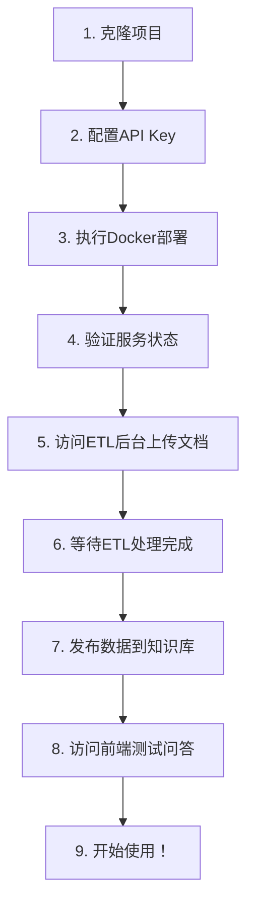

# Docker 部署教程

本教程将指导您如何使用 Docker 部署 GC-QA-RAG 系统。提供两种部署方式：**一键部署**（推荐）和**单独部署**。

## 1. 环境准备

### 必需工具

-   Docker 20.0+
-   Docker Compose 2.0+

### 系统要求

-   推荐内存：8GB+
-   推荐存储：20GB+ 可用空间

## 2. 部署前必要配置 ⚠️

**重要提醒**：在执行一键部署之前，您必须先配置以下关键信息，否则服务将无法正常启动。密钥若有变更，需重启服务。

### 2.1 配置 API Key （必须）

系统需要大语言模型和嵌入模型的 API 密钥才能正常工作。

#### ETL 模块配置

编辑 `sources/gc-qa-rag-etl/.config.production.json`：

```json
{
    "das": {
        "base_url_page": "",
        "base_url_thread": "",
        "token": ""
    },
    "llm": {
        "api_key": "your-dashscope-api-key",
        "api_base": "https://dashscope.aliyuncs.com/compatible-mode/v1",
        "model_name": "qwen-plus"
    },
    "embedding": {
        "api_key": "your-dashscope-api-key"
    },
    "vector_db": {
        "host": "http://localhost:6333"
    },
    "root_path": "./.rag-cache",
    "log_path": "./"
}
```

#### 服务端配置

编辑 `sources/gc-qa-rag-server/.config.production.json`：

```json
{
    "database": {
        "host": "rag_mysql_container",
        "port": 3306,
        "username": "search_db_user",
        "password": "12345678",
        "database": "search_db"
    },
    "qdrant": {
        "url": "http://rag_qdrant_container:6333"
    },
    "llm": {
        "provider": "openai",
        "api_key": "your-api-key",
        "base_url": "https://api.openai.com/v1"
    },
    "embedding": {
        "api_key": "your-dashscope-api-key"
    }
}
```

**API Key 获取说明**：

-   **通义千问 API**：访问 [阿里云灵积](https://dashscope.console.aliyun.com/) 获取 API 密钥
-   **OpenAI API**：访问 [OpenAI Platform](https://platform.openai.com/) 获取 API 密钥
-   **其他模型**：根据您选择的大模型提供商获取相应密钥

### 2.2 关于 DAS 配置说明

配置文件中的 `das` 部分是**数据采集系统**的配置：

-   其用于爬取网络文档和论坛帖子
-   如果您只是想测试系统或上传本地文档，可以**留空**
-   系统提供了 ETL 前端界面，支持直接上传文档文件进行处理

## 3. 一键部署（推荐）

### 3.1 部署方式选择

系统提供三种一键部署方式，您可以根据需求选择：

#### 方式一：使用 Docker Hub 镜像（推荐生产环境）

使用 `docker-compose.dockerhub.yml`，使用预发布的 Docker Hub 镜像：

```bash
# 进入部署目录
cd sources/gc-qa-rag-server/deploy

# 使用 Docker Hub 镜像启动服务
docker compose -f docker-compose.dockerhub.yml up -d
```

**适用场景**：

-   ✅ 生产环境部署
-   ✅ 快速启动（无需构建时间）
-   ✅ 使用稳定版本
-   ✅ 网络环境良好

#### 方式二：自动构建部署（推荐新手）

使用 `docker-compose.yml`，系统会自动构建最新代码：

```bash
# 进入部署目录
cd sources/gc-qa-rag-server/deploy

# 构建并启动所有服务（首次运行会自动构建镜像）
docker compose up -d --build
```

**适用场景**：

-   ✅ 首次部署
-   ✅ 开发测试环境
-   ✅ 希望使用最新代码
-   ✅ 不想手动构建镜像

#### 方式三：预构建镜像部署

使用 `docker-compose.image.yml`，使用本地预构建的镜像：

```bash
# 进入部署目录
cd sources/gc-qa-rag-server/deploy

# 首先构建所需镜像
cd ../
docker build -t rag-server:latest .
cd ../gc-qa-rag-frontend
docker build -t rag-frontend:latest .

# 返回部署目录并启动服务
cd ../gc-qa-rag-server/deploy
docker compose -f docker-compose.image.yml up -d
```

**适用场景**：

-   ✅ 版本控制严格的环境
-   ✅ 已有本地镜像仓库
-   ✅ 网络环境受限

### 3.2 服务组成

两种部署方式都包含完整的 RAG 系统核心服务：

-   MySQL 数据库
-   Qdrant 向量数据库
-   RAG 后端服务
-   RAG 前端界面

**注意**：以上仅包含 RAG 系统核心服务，ETL 数据处理模块需要单独部署。

**说明**：

-   首次部署时，系统会自动构建 `rag-server` 和 `rag-frontend` 镜像，可能需要几分钟时间
-   `--build` 参数确保使用最新代码构建镜像

### 3.3 ETL 模块部署

ETL 模块负责数据采集、处理和向量化，是完整 RAG 系统的重要组成部分。需要在核心服务启动后单独部署：

#### 方式一：使用 Docker Hub 镜像（推荐）

```bash
# 进入 ETL 目录
cd sources/gc-qa-rag-etl/deploy

# 使用 Docker Hub 镜像启动服务
docker compose -f docker-compose.dockerhub.yml up -d
```

#### 方式二：本地构建部署

```bash
# 进入 ETL 目录
cd sources/gc-qa-rag-etl

# 构建 Docker 镜像
docker build -t rag-etl:latest .

# 运行容器
docker run -d \
  --name rag-etl \
  -p 8001:8001 \
  -e GC_QA_RAG_ENV=production \
  rag-etl:latest
```

### 3.4 服务访问

部署完成后，可通过以下地址访问：

-   **前端界面**：http://localhost
-   **后端 API**：http://localhost:8000
-   **MySQL**：localhost:3306
-   **Qdrant**：http://localhost:6333

ETL 应用：

-   **ETL 管理界面**：http://localhost:8001

### 3.5 默认配置

| 服务       | 端口      | 用户名         | 密码     |
| ---------- | --------- | -------------- | -------- |
| MySQL      | 3306      | search_db_user | 12345678 |
| MySQL Root | 3306      | root           | 12345678 |
| Qdrant     | 6333/6334 | -              | -        |
| ETL        | 8001      | -              | -        |

### 3.6 停止服务

根据您使用的部署方式选择对应的停止命令：

#### 方式一：Docker Hub 镜像部署

```bash
# 停止所有服务
docker compose -f docker-compose.dockerhub.yml down

# 停止服务并删除数据卷（谨慎操作）
docker compose -f docker-compose.dockerhub.yml down -v
```

#### 方式二：自动构建部署

```bash
# 停止所有服务
docker compose down

# 停止服务并删除数据卷（谨慎操作）
docker compose down -v
```

#### 方式三：预构建镜像部署

```bash
# 停止所有服务
docker compose -f docker-compose.image.yml down

# 停止服务并删除数据卷（谨慎操作）
docker compose -f docker-compose.image.yml down -v
```

#### 停止 ETL 服务

**Docker Hub 镜像部署：**

```bash
# 停止 ETL 服务
docker compose -f docker-compose.dockerhub.yml down
```

**本地构建部署：**

```bash
# 停止 ETL 服务
docker stop rag-etl
docker rm rag-etl
```

## 4. 部署后使用流程 🚀

部署成功后，请按照以下步骤开始使用系统：

### 4.1 验证服务状态

首先确认所有服务都已正常启动：

```bash
# 查看所有服务状态
docker compose ps

# 所有服务都应该显示为 "running" 状态
```

### 4.2 第一步：准备数据（ETL 处理）

**⚠️ 重要**：刚部署的系统中，Qdrant 向量数据库是空的，您需要先上传和处理文档数据。

1. **访问 ETL 管理后台**：http://localhost:8001

2. **上传文档**：

    - 上传您的 PDF、Word、Markdown 等文档文件

3. **处理数据**：

    - 系统会自动将文档转换为问答对
    - 生成向量并存储到 Qdrant 数据库
    - 处理过程可能需要几分钟，取决于文档大小

4. **发布到知识库**：
    - 在 ETL 界面中，将处理好的数据发布到 RAG 系统
    - 确保数据已成功同步到向量数据库

### 4.3 第二步：测试问答系统

1. **访问前端界面**：http://localhost:80

2. **开始提问**：
    - 基于您上传的文档内容进行提问
    - 系统会从向量数据库中检索相关信息并生成答案

### 4.4 故障排除

如果遇到问题，请按以下顺序检查：

1. **API Key 配置错误**：

    ```bash
    # 查看服务端日志
    docker compose logs server
    # 查看ETL日志
    docker logs rag-etl
    ```

2. **向量数据库为空**：

    - 确认 ETL 处理步骤已完成
    - 访问 http://localhost:6333/dashboard 查看 Qdrant 数据库状态

3. **文档上传失败**：
    - 检查文档格式是否支持（PDF、Word、Markdown、TXT 等）
    - 确认 ETL 服务正常运行

### 4.5 完整的新手操作流程

对于完全陌生的用户，建议按以下顺序操作：



**详细步骤**：

1. 克隆项目到本地
2. 按照"2.1 配置 API Key"修改配置文件
3. 运行 `docker compose up -d --build`
4. 等待所有容器启动完成
5. 访问 http://localhost:8001 上传您的文档
6. 在 ETL 界面中处理文档（生成 QA 对和向量）
7. 将处理好的数据发布到 RAG 系统
8. 访问 http://localhost:80 开始问答
9. 享受智能问答体验！

## 5. 单独部署

如果需要更灵活的部署方式，可以单独构建和部署各个模块。

### 5.1 后端服务部署

```bash
# 进入服务端目录
cd sources/gc-qa-rag-server

# 构建 Docker 镜像
docker build -t rag-server:latest .

# 创建配置文件挂载点
mkdir -p config

# 运行容器
docker run -d \
  --name rag-server \
  -p 8000:8000 \
  -e GC_QA_RAG_ENV=production \
  rag-server:latest
```

### 5.2 前端界面部署

```bash
# 进入前端目录
cd sources/gc-qa-rag-frontend

# 先构建前端资源
pnpm install
pnpm run build

# 构建 Docker 镜像
docker build -t rag-frontend:latest .

# 运行容器
docker run -d \
  --name rag-frontend \
  -p 80:80 \
  rag-frontend:latest
```

### 5.3 数据库部署

#### MySQL 部署

```bash
docker run -d \
  --name rag-mysql \
  -p 3306:3306 \
  -e MYSQL_ROOT_PASSWORD=12345678 \
  -e MYSQL_DATABASE=search_db \
  -e MYSQL_USER=search_db_user \
  -e MYSQL_PASSWORD=12345678 \
  -v rag-mysql-data:/var/lib/mysql \
  mysql:latest
```

#### Qdrant 部署

```bash
docker run -d \
  --name rag-qdrant \
  -p 6333:6333 \
  -p 6334:6334 \
  -e QDRANT__SERVICE__GRPC_PORT=6334 \
  -e QDRANT__SERVICE__HTTP_PORT=6333 \
  -v rag-qdrant-data:/qdrant/storage \
  --memory 8g \
  qdrant/qdrant:latest
```

## 6. 配置文件说明

### 6.1 ETL 配置

在 `sources/gc-qa-rag-etl/.config.production.json` 中配置：

```json
{
    "das": {
        "base_url_page": "",
        "base_url_thread": "",
        "token": ""
    },
    "llm": {
        "api_key": "",
        "api_base": "https://dashscope.aliyuncs.com/compatible-mode/v1",
        "model_name": "qwen-plus"
    },
    "embedding": {
        "api_key": "your-dashscope-api-key"
    },
    "vector_db": {
        "host": "http://localhost:6333"
    },
    "root_path": "./.rag-cache",
    "log_path": "./"
}
```

### 6.2 服务端配置

在 `sources/gc-qa-rag-server/.config.production.json` 中配置：

```json
{
    "database": {
        "host": "rag_mysql_container",
        "port": 3306,
        "username": "search_db_user",
        "password": "12345678",
        "database": "search_db"
    },
    "qdrant": {
        "url": "http://rag_qdrant_container:6333"
    },
    "llm": {
        "provider": "openai",
        "api_key": "your-api-key",
        "base_url": "https://api.openai.com/v1"
    }
}
```

## 7. 生产环境优化

### 7.1 资源限制

在 `docker-compose.yml` 中添加资源限制：

```yaml
services:
    server:
        deploy:
            resources:
                limits:
                    memory: 2G
                    cpus: "1.0"
                reservations:
                    memory: 1G
```

## 8. 常见问题

### 8.1 端口冲突

如果端口被占用，可以修改 `docker-compose.yml` 中的端口映射：

```yaml
ports:
    - "8080:8000" # 将后端服务映射到 8080 端口
```

### 8.2 内存不足

如果系统内存不足，可以调整 Qdrant 的内存限制：

```yaml
deploy:
    resources:
        limits:
            memory: 4G # 降低内存限制
```

### 8.3 数据持久化

确保数据卷正确挂载，避免容器重启后数据丢失：

```bash
# 查看数据卷
docker volume ls

# 备份数据卷
docker run --rm -v rag-mysql-data:/data -v $(pwd):/backup alpine tar czf /backup/mysql-backup.tar.gz -C /data .
```

### 8.4 网络连接问题

如果容器间无法通信，检查网络配置：

```bash
# 查看网络
docker network ls

# 检查容器网络
docker network inspect rag_network
```

### 8.5 Docker Hub 镜像相关问题

#### Q: 拉取镜像失败，提示 "manifest not found"

A: 检查镜像名称是否正确，确认镜像已发布到 Docker Hub

#### Q: 使用 Docker Hub 镜像启动失败

A: 确认已正确修改配置文件中的用户名，并检查网络连接

#### Q: 如何更新到最新版本的镜像

A: 使用以下命令拉取最新镜像：

```bash
docker pull grapecitysoftware/gc-qa-rag-server:latest
docker pull grapecitysoftware/gc-qa-rag-frontend:latest
docker pull grapecitysoftware/gc-qa-rag-etl:latest
```

#### Q: 如何查看镜像版本信息

A: 使用以下命令查看镜像详情：

```bash
docker inspect grapecitysoftware/gc-qa-rag-server:latest
```

## 9. 监控和维护

### 9.1 容器状态监控

```bash
# 查看所有服务状态
docker compose ps

# 查看服务日志
docker compose logs -f server

# 查看资源使用情况
docker stats
```

通过以上步骤，您就可以成功部署 GC-QA-RAG 系统了。推荐使用 Docker Hub 镜像部署方式，简单快捷且配置完整。
